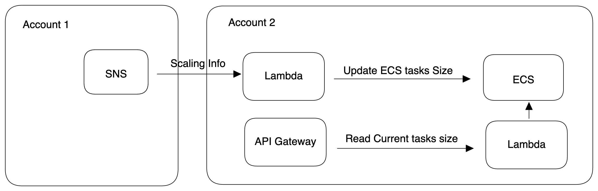

# Overview
This repo is part of the ECS Tasks Scaling POC, which contains an `API Gateway + Lambda + ECS` stack in account 2.

The first Lambda is to update the ECS tasks size, and the API Gateway calls the second Lambda to check if the ECS tasks size has been updated.

Please see SNSForECSScaling repo for SNS in account 1.




## What can be improved
This architecture does not enable auto scaling for ECS. We use [boto3 ECS.update_service](https://boto3.amazonaws.com/v1/documentation/api/latest/reference/services/ecs.html#ECS.Client.update_service) API to update the ECS tasks size.

With auto scaling enabled, we can disable scale in while manually updating the ECS tasks size. 

Use the [update_scaling_plan](https://boto3.amazonaws.com/v1/documentation/api/latest/reference/services/autoscaling-plans.html#AutoScalingPlans.Client.update_scaling_plan) API to set `DisableScaleIn` as `True`, and set `DisableScaleIn` as `False` when scale down to original size.


## CDK

The `cdk.json` file tells the CDK Toolkit how to execute your app.

This project is set up like a standard Python project.  The initialization
process also creates a virtualenv within this project, stored under the `.venv`
directory.  To create the virtualenv it assumes that there is a `python3`
(or `python` for Windows) executable in your path with access to the `venv`
package. If for any reason the automatic creation of the virtualenv fails,
you can create the virtualenv manually.

To manually create a virtualenv on MacOS and Linux:

```
$ python3 -m venv .venv
```

After the init process completes and the virtualenv is created, you can use the following
step to activate your virtualenv.

```
$ source .venv/bin/activate
```

If you are a Windows platform, you would activate the virtualenv like this:

```
% .venv\Scripts\activate.bat
```

Once the virtualenv is activated, you can install the required dependencies.

```
$ pip install -r requirements.txt
```

At this point you can now synthesize the CloudFormation template for this code.

```
$ cdk synth
```
Then, you can deploy your cdk.
```
$ cdk deploy
```